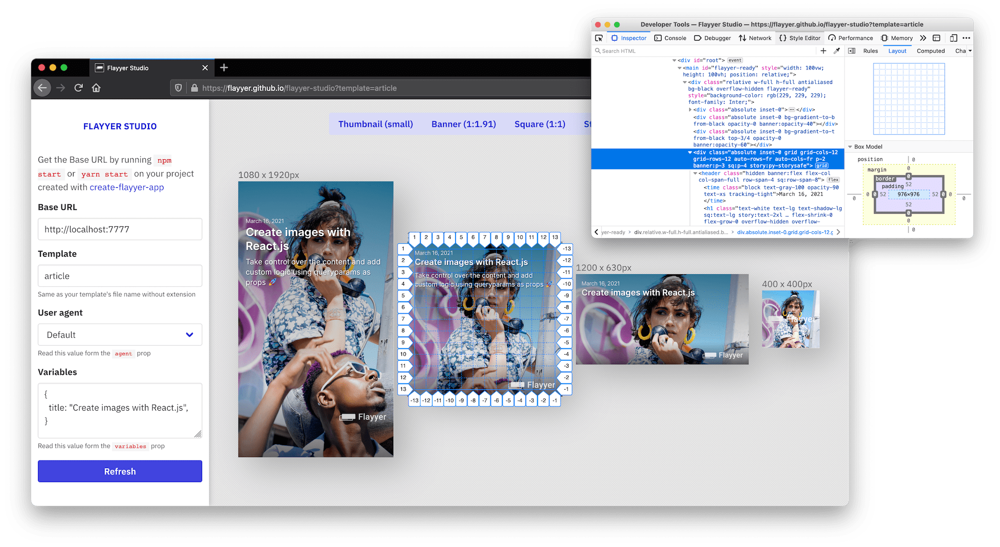

# [useflyyer.github.io/studio](https://useflyyer.github.io/studio)

Companion of [@flyyer/cli](https://github.com/useflyyer/flyyer-cli)

[](https://useflyyer.github.io/studio)

> Photo by Calbert Warner from [Pexels](https://www.pexels.com/photo/woman-above-man-2889943/)

There is no need to run this on your machine, just go to [the deployed site on GitHub](useflyyer.github.io/studio) to develop and preview your flyyer templates.

```sh
yarn add --dev @flyyer/cli
yarn run flyyer start
# Opens https://useflyyer.github.io/studio
```

After testing in a couple of browsers **we recommend running this on Firefox**. The only way of running this on Safari is by cloning this repository and running it locally.

---

## Local server

In the case you want to run this locally:

Clone the repository and install all the dependencies:

```sh
git clone https://github.com/useflyyer/studio.git
cd studio
yarn install
```

Run at [http://localhost:3000](http://localhost:3000):

```sh
yarn build
yarn start
```

## Development

Run on development mode at [http://localhost:3000](http://localhost:3000):

```sh
yarn dev
```

## Deploy to GitHub Pages

> Documentation for the developers at Flyyer

Make sure you are part of the `flyyer` organization, then run:

```sh
NODE_ENV=production yarn run build && yarn run export && yarn run deploy
```
